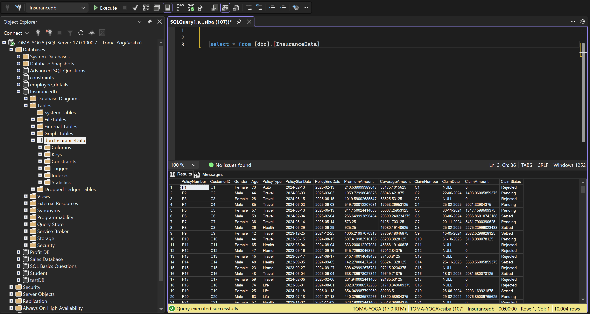
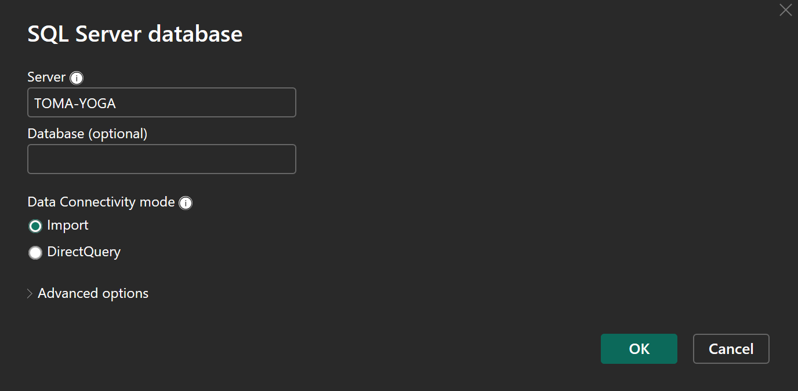
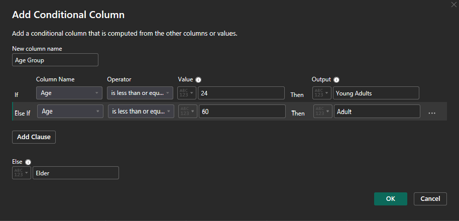
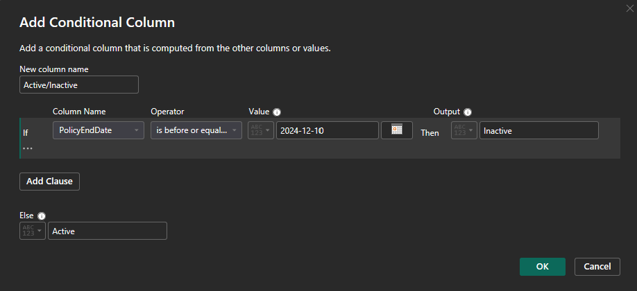
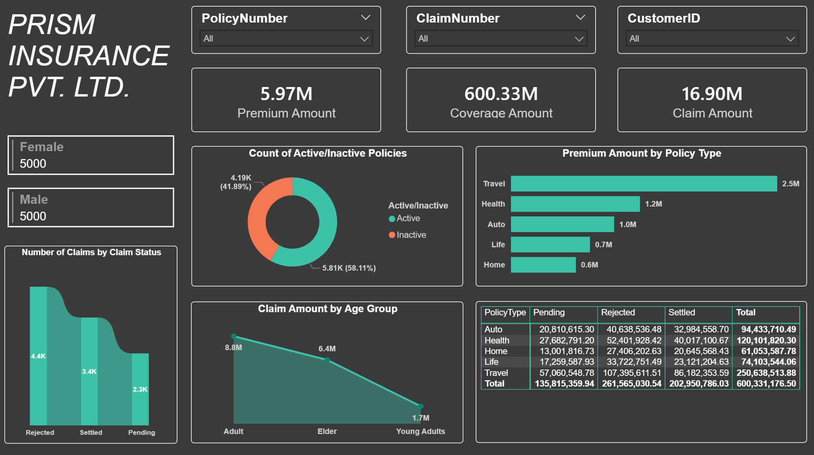
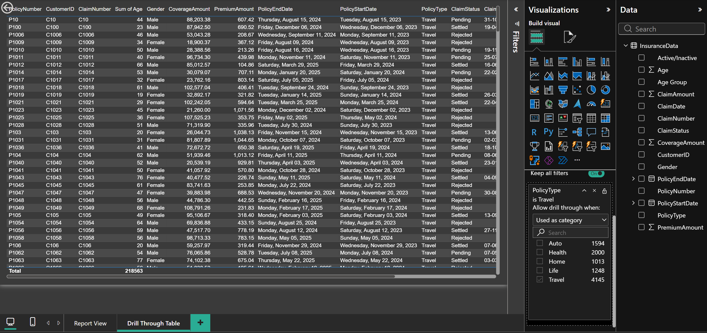

# Insurance Data Analytics (Power BI)

## Introduction
This Power BI project analyzes an insurance portfolio by combining **policy-level** information with **claim-related** outcomes to provide clear, interactive insights. The goal is to transform raw data into a reporting layer that supports:

- **Business monitoring** (e.g., premium volume, coverage exposure, claim status distribution)
- **Analytical insights** (e.g., claim patterns across policy types, age groups, and customer segments)

As a first step, the dataset was prepared by importing the source CSV into **Microsoft SQL Server**, creating a structured and reusable table that Power BI can reliably consume for modeling, DAX measures, and dashboard development.

## Documentation
A complete, detailed project documentation is available in: `Insurance_Data_Analysis_Documentation.pdf`.

---

## Data Source & SQL Server Import (CSV → dbo.InsuranceData)

### Data source
The project is based on a CSV file named **`InsuranceData`**, which contains records related to insurance policies and claims.

### Import into SQL Server
The CSV file was imported into **Microsoft SQL Server**, and the data was loaded into:

- **Database:** `Insurancedb`  
- **Schema/Table:** `dbo.InsuranceData`  
- **Row count:** **10,004 rows** (confirmed after import)

Validation query used after loading:

```sql
SELECT *
FROM [dbo].[InsuranceData];
```



### Main columns (high level)
The `dbo.InsuranceData` table contains the key attributes needed for insurance reporting and claim analysis, including:

- **PolicyNumber** – unique policy identifier  
- **CustomerID** – customer identifier  
- **Gender**, **Age** – customer demographics  
- **PolicyType** – insurance product category (e.g., Auto, Travel, Health, Home, Life)  
- **PolicyStartDate**, **PolicyEndDate** – policy active period  
- **PremiumAmount** – premium value associated with the policy  
- **CoverageAmount** – coverage/insured amount (exposure)  
- **ClaimNumber** – claim identifier (when applicable)  
- **ClaimDate** – date of the claim event (when applicable)  
- **ClaimAmount** – monetary value of the claim (when applicable)  
- **ClaimStatus** – claim processing status (e.g., Pending / Settled / Rejected)

---

## Power BI - SQL Server Connection
The dataset was imported into Power BI directly from Microsoft SQL Server using the native **SQL Server database** connector.  
The connection was configured in **Import** mode to enable fast in-memory analytics, DAX calculations, and interactive visuals.

**Connection details (high level):**
- **Server:** TOMA-YOGA
- **Connectivity mode:** Import
- **Source table:** Insurancedb.dbo.InsuranceData



---

## Data Preparation (Power Query)
To support segmentation and clearer reporting, two additional derived columns were created in Power Query using **Conditional Column** rules. These columns are used for filtering, grouping, and high-level analysis in the report.

### Age Group (Conditional Column)
A new `Age Group` column was derived from `Age` to enable demographic segmentation in visuals and slicers:

- **Young Adults:** Age <= 24  
- **Adult:** Age <= 60  
- **Elder:** Age > 60  



### Active vs Inactive Policy (Conditional Column)
A new `Active/Inactive` status column was derived from `PolicyEndDate` to differentiate active policies from expired ones (using a cut-off date):

- **Inactive:** PolicyEndDate <= 2024-12-10  
- **Active:** otherwise  



---

## Report Page – Overview Dashboard (PRISM INSURANCE PVT. LTD.)

This page serves as the main **executive overview** of the insurance portfolio, combining policy-level exposure and claim-related indicators into a single interactive view. It is designed for quick monitoring of overall performance and for exploring patterns by policy, customer, product type, demographics, and claim status.



### Page objectives
- Provide a high-level snapshot of the portfolio using key KPIs (Premium, Coverage, Claim Amount).
- Enable rapid filtering by individual identifiers (PolicyNumber, ClaimNumber, CustomerID).
- Show distribution and breakdowns across **policy lifecycle status** (Active/Inactive), **policy type**, **claim status**, and **age segments**.

---

### Filters / Slicers (Top navigation)
- **PolicyNumber**: filters the entire report to a specific policy (or multiple policies).
- **ClaimNumber**: filters to a specific claim record (or set of claims).
- **CustomerID**: filters the report to a specific customer profile.

These slicers are meant to support both **portfolio-level browsing** (All) and **case-level analysis** (single policy/claim/customer).

---

### KPI Cards (Top row)
- **Premium Amount (5.97M)**: total premium volume for the current filter context.
- **Coverage Amount (600.33M)**: total exposure / insured amount (coverage) in the portfolio.
- **Claim Amount (16.90M)**: total claim value for the current filter context.

These KPIs update dynamically based on the slicers and cross-filtering from visuals.

---

### Demographics summary (Left side)
- **Gender distribution tiles**
  - Female: 5000
  - Male: 5000

These cards provide a quick demographic split and can act as an at-a-glance indicator of customer distribution.

---

### Portfolio status (Center)
**Donut chart – Count of Active/Inactive Policies**
- Active: **5.81K (58.11%)**
- Inactive: **4.19K (41.89%)**

This visual summarizes the lifecycle status of the portfolio using the derived `Active/Inactive` column, making it easy to track how much of the portfolio is still active versus expired.

---

### Product performance (Right)
**Bar chart – Premium Amount by Policy Type**
- Travel: ~2.5M
- Health: ~1.2M
- Auto: ~1.0M
- Life: ~0.7M
- Home: ~0.6M

This chart highlights which product lines contribute the most to premium volume and supports ranking/comparison across policy types.

---

### Claims monitoring (Bottom left)
**Column chart – Number of Claims by Claim Status**
- Rejected: ~4.4K
- Settled: ~3.4K
- Pending: ~2.3K

This view provides operational insight into claim processing outcomes and can be used to investigate potential bottlenecks (e.g., high Pending volume) or quality signals (e.g., high Rejected rate).

---

### Risk / cost segmentation (Bottom center)
**Line/Area chart – Claim Amount by Age Group**
- Adult: ~8.8M
- Elder: ~6.4M
- Young Adults: ~1.7M

This visual uses the derived `Age Group` column to compare claim cost distribution across age segments and identify the most claim-cost-intensive groups.

---

### Detailed breakdown (Bottom right)
**Matrix – Coverage Amount by Policy Type and Claim Status**
A detailed table view that breaks down amounts by:
- **Rows:** PolicyType (Auto, Health, Home, Life, Travel)
- **Columns:** ClaimStatus (Pending, Rejected, Settled) + Total

This matrix supports deeper validation and helps explain the KPI totals by showing where exposure is concentrated across product lines and statuses.

---

### User experience & design notes
- The page uses a consistent **dark theme** with clear containers for each visual.
- Key measures are surfaced as KPI cards for immediate readability.
- Cross-filtering across visuals enables exploration (e.g., selecting a policy type updates claim status distribution and related KPIs).

---

## Report Page – Drill Through Table

This page is a dedicated **drill-through detail view** designed to display the underlying records behind the high-level visuals on the Overview dashboard. It enables case-level investigation by showing policy and claim attributes in a single, filterable table.



### Purpose of the page
- Provide a **record-level breakdown** for validation and deeper analysis.
- Support **root-cause investigation** (e.g., why a specific policy type has higher claim amounts or more rejections).
- Allow users to move from summary visuals to **raw detail rows** without leaving the report.

---

### Drill-through configuration
The page is configured as a **drill-through target** using the field:

- **Drill-through field:** `PolicyType`

A drill-through filter panel is displayed on the right side and shows the selected context (e.g., **PolicyType = Travel**). This means that when a user right-clicks a data point on another page (for example, a bar in *Premium Amount by Policy Type*) and selects **Drill through**, they are navigated here with the relevant `PolicyType` applied.

> The drill-through behavior is controlled in Power BI using the “Allow drill through when: Used as category” setting for the selected field.

---

### Applied filters (example shown)
In the screenshot, the drill-through filter is set to:
- **PolicyType = Travel**

This dynamically filters the entire table to show only records matching the selected policy type.

---

### Main visual: Detail Table
A large table visual displays the dataset at row level. It includes a mix of identifiers, demographic attributes, financial values, and dates to give full context for each record.

**Columns visible in the table include:**
- **PolicyNumber** – policy identifier  
- **CustomerID** – customer identifier  
- **ClaimNumber** – claim identifier  
- **Sum of Age** (Age) – customer age (aggregated field label shown by Power BI)  
- **Gender** – customer gender  
- **CoverageAmount** – coverage / exposure amount  
- **PremiumAmount** – premium amount  
- **PolicyEndDate** – policy end date  
- **PolicyStartDate** – policy start date  
- **PolicyType** – insurance product type  
- **ClaimStatus** – claim status (Pending / Rejected / Settled)  
- **ClaimDate** – claim date (when applicable)

> Note: In a table visual, Power BI may display numeric fields with an implicit aggregation label (e.g., “Sum of Age”). If the intention is to show the raw value per row, the field can be set to **“Don’t summarize”**.

---

### How this page is used (typical workflow)
1. User reviews a KPI or chart on the Overview page (e.g., PolicyType premium ranking).
2. User right-clicks a chart element (e.g., Travel) and chooses **Drill through → Drill Through Table**.
3. This page opens with the drill-through context applied (e.g., `PolicyType = Travel`).
4. User scans or exports the detailed rows to verify patterns and identify outliers (e.g., unusually high claims, many rejected claims, policy date anomalies).

---

### Why it matters
- Improves **traceability** from summary visuals to individual records.
- Helps validate KPI totals and matrix breakdowns.
- Supports audit-like analysis (e.g., checking which exact records contribute to a high claim amount or a spike in rejected claims).

---

## Row-Level Security (RLS)
To demonstrate secure data access in Power BI, **Row-Level Security (RLS)** was implemented using role-based filters. RLS ensures that different user groups can only see the subset of records they are authorized to access, while using the same report and data model.

### Security roles based on PolicyType
Two example roles were created in Power BI Desktop under **Manage roles**. Each role restricts rows in the `InsuranceData` table by filtering the `PolicyType` column:

- **Health Role:** `PolicyType` equals `"Health"`
- **Travel Role:** `PolicyType` equals `"Travel"`

With these roles in place, the same visuals and measures automatically recalculate based on the role filter, providing a realistic example of how product- or department-specific access can be enforced in a shared reporting solution.


